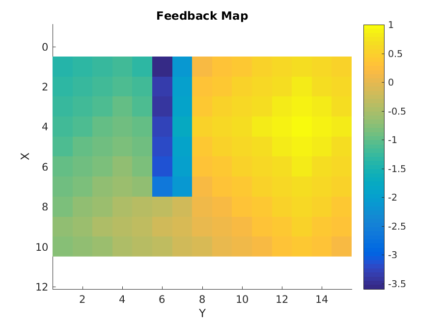
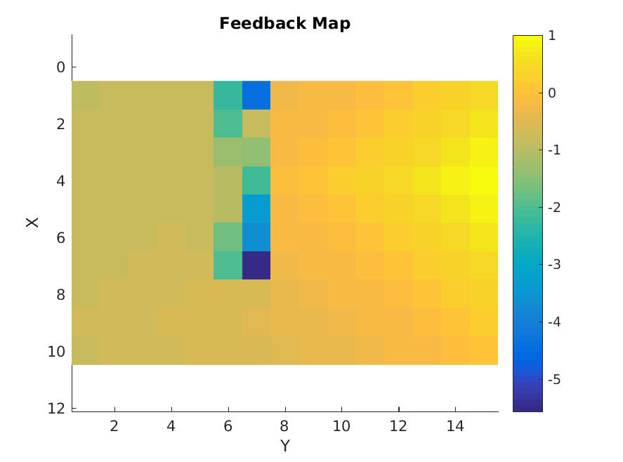
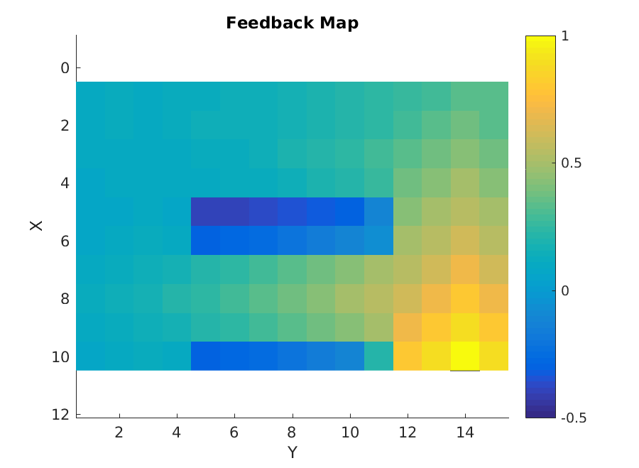
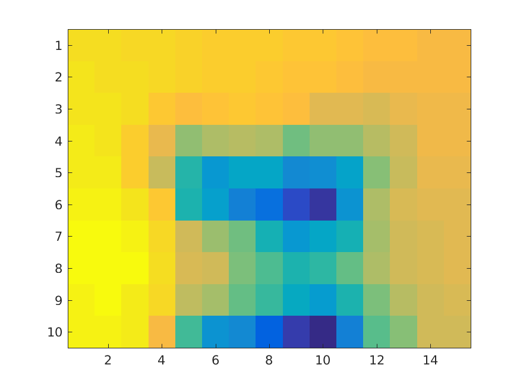
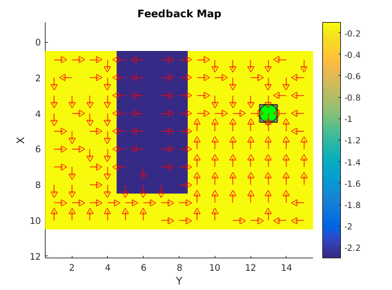
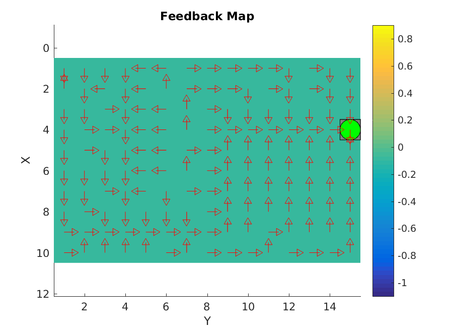
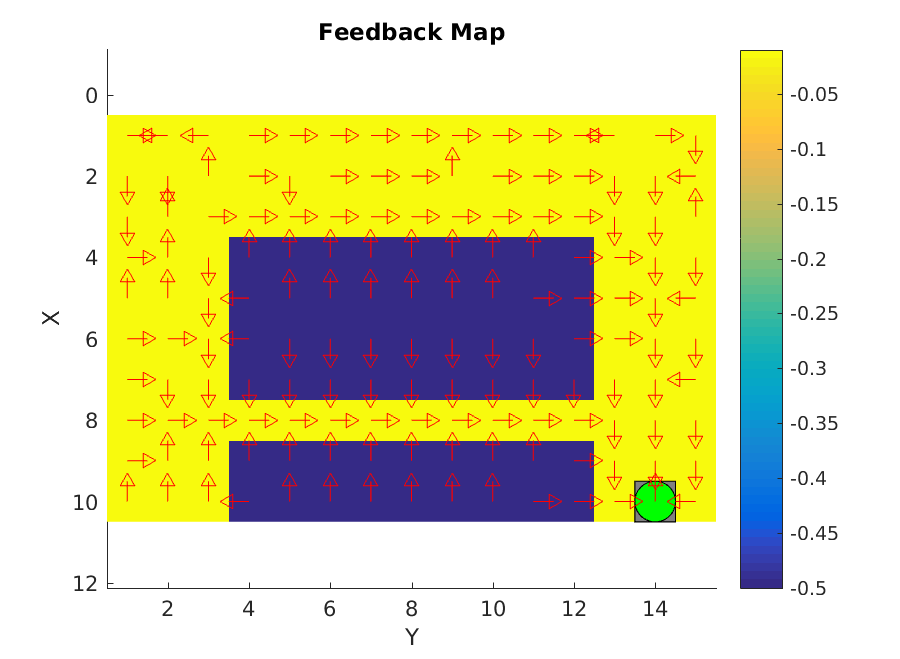
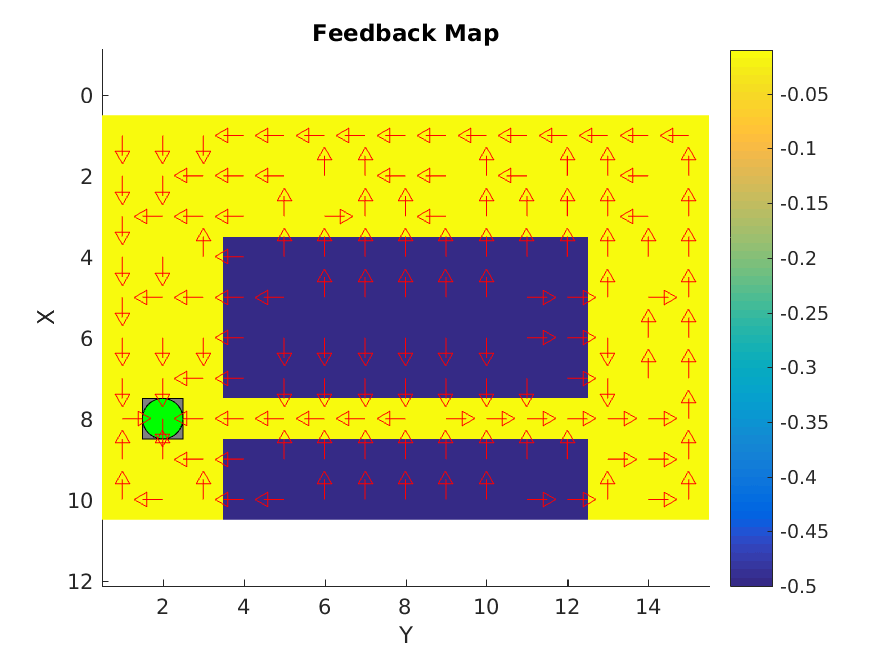

# Introduction

This fourth assignment is about reinforcement learning, which is a type of learning algorithms where the system learns something based on a scalar feedback. This learning method uses different states where it is possible to perform different actions for each state and each action will give a reward. 

Specifically we have implemented the Q-learning method, which is a robust method easy to implement. This method is based on the Q-matrix that will be explained.

We are given 4 different worlds and the goal is to make a "robot" learn the best path to reach the destination. Each world has its own particular properties that will be also studied.

# Theory and Implementation

The Q-function is represented by a matrix where there are defined the different states and all the posible actions that can be taken for each state (in our case the states are represented by the position in the world "x,y"  and the policies are 1-down, 2-up, 3-right, 4-left). For every state the Q value is initialized in 1 (so all the possible actions have the same probability of being used at the beginning) and then in the phase of training, every Q value is updated based on the reward obtained after performing one action and the maximum Q-value of the actions in the next state. The V-function is also represented by a matrix in our case and it represents the expected reward in the rest steps until the goal for a given state.

If we set the values of the Q-function randomly, then the policy at the begining is called arbitrary policy since the values (actions to take) of the V-function are going to be chosen randomly.

A learning rule for the Q-function that we use for this assignment is the following:

$$Q(s_{k},a_{j}) \leftarrow (1-\alpha) Q(s_{k},a_{j}) + \alpha (r+\gamma V_{s_{k+1}})$$

where $Q(s_{k},a_{j})$ is the Q-value of the action $a_{j}$ in the state $s_{k}$.

So we update the Q-value based on the previous value and the reward obtained by doing a given action $a_{j}$ and the maximum Q value in the next state. There are 2 different factors ($\alpha$ and $\gamma$) that we use to give more importance to the new learned experience ($\alpha$ close to 0) or overwrite previous experience ($\alpha$ close to 1). $\gamma$ is a discount factor that maximize the close term reward if is close to 0 or maximize the long term reward if it is close to 1.

We are also using the exploration factor $\epsilon$ which is a factor that allows the robot to explore new things (choosing a random action) or continue using the learned experience. If $\epsilon$ is close to 1 it will explore and if it is close to 0 it will be focus on already known experience. In our implementation, $\epsilon$ is initialized in 1 (to explore always) and in each iteration its value is decreasing until in the last one its value is 0 since it is better to use the learned experience at the end.

In our implementation, to avoid the robot from exiting through the borders of a world, we initialize the Q-values of the states that make the robot go away from the world to -100 (high negative value), so that action is not going to be taken in such states. To choose the next action we compare the Q-values and with probability $1 - \epsilon$ we take the action that has the higher value in the Q matrix, and with probability $\epsilon$ we choose randomly the action between all the posibilities (pure exploration). As said before, $\epsilon$ changes its value in each episode to go from 1 to 0. Also for each episode there is a maximum number of steps that the robot can take if it does not arrive to the goal (we have set this maximum number of steps to 500), and then we restart the world again and continue with the next episode. 

To perform the test, we use the higher Q-value after training as the optimal policy.

# Worlds

Between the 4 worlds that we are given there are some differences. For example the first world is a static world where everything remains the same always. In the second world, sometimes there is a blob where the reward inside it is lower than usual and then the algorithm tends to use a policy that avoids passing through this blob (even if it is not showing up). The third world is a static world as the first one and it can be seen how the robot tends to avoid the estates with a low reward. The fourth world is the funniest one since the action that the robot takes is not always the best, and it can be seen in the V-function that it tends to avoid the narrow path between the 2 blobs with low reward (due to the fact that sometimes it ends up inside the blobs) and "returns home" following the edges of the world. With this last world it is shown that the Q-learning method is able to find a good policy in stochastic situations.

## V functions of each world

{width=300px}

{width=300px}

{width=300px}

Worlds 1 to 3 works well with $\alpha = 0.5$, $\gamma = 0.9$, $1000$ episodes and a decreasing $\epsilon$ that starts in 1 in episode 0 and finish in 0 by episode 1000.

{width=300px}

In world 4 however this setting doesn't work all times. To ensure success we used $\alpha = 0.1$, $\gamma = 1.0$, and $10000$ episodes instead.

\newpage

## Q functions of each world

{width=300px}

{width=300px}

{width=300px}

Worlds 1 to 3 works well with $\alpha = 0.5$, $\gamma = 0.9$, $1000$ episodes and a decreasing $\epsilon$ that starts in 1 in episode 0 and finish in 0 by episode 1000.

{width=300px}

## What would happen using Dijkstra’s shortest path finding algorithm in the ”Suddenly Irritating blob” and static ”Irritating blob” worlds?

Dijkstra's shortest path finding can't take in account suddenly changing situations. In suddenly irritating blob world you can't calculate an optimal path in advance because you don't know in what version of the world you are. Q-learning can calculate a good-enough solution to both versions.

## To-HG and from-HG worlds details

In sober HG world the agent learns to go through the shortest path. In drunk HG world however the agent realize that he can easily be punished by trying to go through the shortest path, so he learns to avoid it and uses a longer but more secure path, where random mistakes doesn't have big consequences.

# Reinforcement Learning applications

- Playing board and computer games (Chess, Go, Poker, Atari games...).
- Learn to control high-speed movements in robots (acrobatic quadcopters).
- Industrial control.
- Telecommunication networks.
- ...

# Conclusions

We have seen that Q-learning algorithm is a good decision method in not very complex stochastic environments. It also works fine in deterministic problems but in that situations common search algorithms would work better.

For the problems we have seen in this lab is good to use a big gamma value, to take in account the long-term rewards and not only the inmediate rewards. This is because we are trying to find a way in a map and we only receive rewards at the end of the episode; in a different RL task this could not be the case if the agent could obtain frequent rewards at any time, or if the tarjet were not to solve only a long term objective but middle or short term objectives.

In this task the V function is simple to plot and seems to learn what are the "best" places in the map, considering "best" to be closer to the tarjet. Q function is more tricky to plot and it reveals what is the best action to do in any situation.
